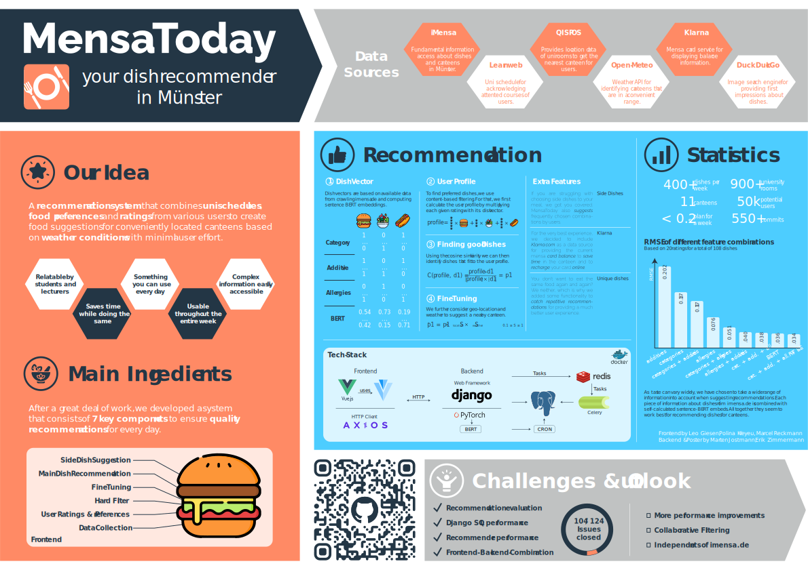
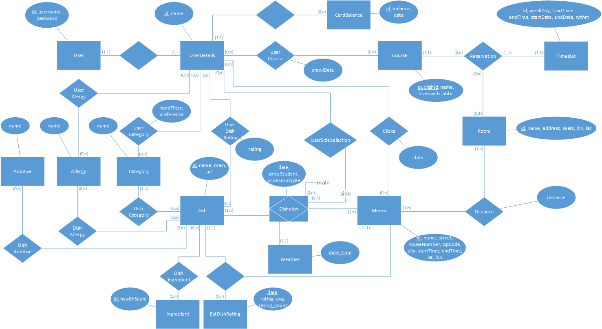

  

# MensaToday - your dish recommender in Münster

Münster is a distributed University with various different canteens and bistros that serve different ranges of food which change every week. As a student who eats at those places frequently, you have to look through all of these dishes to find a meal you want to eat. The idea of our recommender system is to suggest meals based on various different factors: Your eating habits, location (based on semester schedule), weather, ….

## Contributing
See [our contributing guidelines](https://github.com/erikzimmermann/mensa-today/blob/development/CONTRIBUTING.md) for detailed information about testing, documentation and project setup.

## Celery

Celery is an open source asynchronous task queue or job queue which is based on distributed message passing. While it supports scheduling, its focus is on operations in real time. Celery is used in combination with the message broker redis. For more information, see [Celery docs](https://docs.celeryq.dev/en/stable/).

## Data Structure
last updated on 30th December 2022

